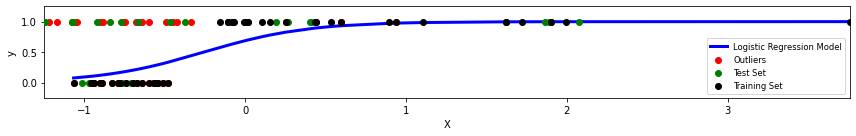

# Data Preprocessing an Visualization

Because the project has had several iterations, there was already a lot of work done with the data, including some code which made it a little more convenient to work with our dataset.

## The dataset

The provided dataset consisted of directories with the patients and their executed exercises, split up into their corresponding category directories:
```
+-- Category_1          # Category folder
|   +-- 1               # Patient
|       +-- AB1.txt     # Single exercise file (TXT)
|       +-- AB1.csv     # Single exercise file (CSV)
|       +-- AB2.txt
|       +-- AB2.csv
|       +-- ...
|   +-- 2
|       +-- AB1.txt
|       +-- ...
|   +-- ...
+-- Category_2
|   +-- ...
+-- ...
```

Wherein the `*.txt` files included the positional XYZ-data of each sensor and the rotation matrix for that sensor. The file contains data in the following format:
```
[sensor_number] [position_x]  [position_y]  [position_z]
                [rotation_x1] [rotation_y1] [rotation_z1]
                [rotation_x2] [rotation_y2] [rotation_z2]
                [rotation_x3] [rotation_y3] [rotation_z3]
```
This format is repeated for every sensor number and repeated for each recorded frame for the exercise.

 The `*.csv` files include calibrated euler angles for each of the following bones both left and right:
 - Thorax (3 parts)
 - Clavicula (3 parts)
 - Scapula (3 parts)
 - Humerus (3 parts)
 - Elbow (1 angle)

## Existing Code

From the code that was delivered to us at the start of the project, I compiled a library file called `ortho_lib`. This library was used throughout the project with most of the tasks we needed to execute.

Of course, we made some additions to the code to expand the functionality and possibilties. This file has been modified throughout the project by both me and my teammembers to suite the needs of the project at the time.

One of these changes was in the processing of feauture value generation. This was originally done by just calculating the maximum value of a feature. I rewrote the `Patient` class to accept all column and row aggregation methods included in `pandas` (`max`, `min`, `avg`, `std` etc.). The diff for this can be found [here](code/diffs/patient.md). The new version of the `Patient` class also includes the final combinations for features and mathematical operations for specific exercises. It might not be the most efficient code, but it works and is not that slow.

The library is found [here](code/ortho_lib.py).

When we started, I wrote a guide for the rest of the group to understand the class structure and functions of the library. This guide can be found [here](notebooks/__Using_ortho_lib.ipynb). The guide is a bit outdated, as it hasn't been updated since week 6 or so.

## Visualization
At the start of the project I wanted to visualize the data as much as possible, to understand the stucture and get a better feeling for the data. 

For convenience I wrote a small library file called `ortho_plot`. This library also contains functions to easily plot a single exercise (in Pandas dataframe) in 2d and 3d. This file has been modified throughout the project by both me and my teammembers to suit the needs of the project at the time.

The library is found [here](code/ortho_plot.py).

When we started, I wrote a guide for the rest of the group to understand the class structure and functions of the library. This guide can be found [here](notebooks/__Using_ortho_plot.ipynb).

Below I describe visualizations for the data that may or may not be included in the library.

#### **Animated visualization of an individual**
To better get a feeling for what information we could get from the data, I wanted to make a 3-dimensional visualization of the data by plotting it in a `plotly` 3D graph. Luckily, in a previous iteration of the project, a basic notebook existed for this. I wasn't happy with the notebook, because of the anchor sensor that was included and the fact that sensors weren't connected. I [changed the notebook](notebooks/movement_all.ipynb) so that the anchor is removed in the plot and the plot came out as a sort of 'stick figure'.

This notebook has helped a lot when we were cleaning the data to remove the noise.

##### **Plotting rotational data**
To better understand the rotational data, I wanted to plot each sensor's data in the 3D graphs described above. I wanted to have an arrow or something like an arrow pointing in the direction the rotation matrices described. I succeeded in plotting `plotly` cones in the directions, but later I realized we wouldn't really need these visualizations and I abandonded the [notebook](notebooks/plot_rotational_data.ipynb).

#### **Regression model (and related) visualizations**
The model created uses a simple method of temporarily removing individuals from the training data to fit a Logistic Regression model. It uses a single hyperparameter to separate the datapoints for `y=0` and `y=1`. The visualization for this separation can be found [here](notebooks/visualize_factor.ipynb). It includes the training (or loading results) of models for 20 intervals of the `factor` parameter in order to fetch the features that are included in the model. It then outputs distibution graphs for which of the datapoints are discarded/included for a certain factor.

At the end of the project we realized some of the features we selected gave some inconsistent results when evaluating on the test set. This was due to the way we setup the [final experiment](notebooks/final_experiment.ipynb), we didn't scale our test set properly. So I created a method to visualize the regression models in a distribution graph. Later the scaling was fixed, and we had some nice visualizations for the Logistic Regression models like the one below.
<details>
<summary>Regression visualization example</summary>

</details>

#### **Visualization of velocity and acceleration**
Two feature groups we wanted to explore were the velocity and accelaration of movements. We calculated the velocity by calculating the difference of positions over each frame, and the accelation by calculating the difference of velocities over each velocity frame. The notebook for visualizing these values can be found [here](notebooks/transform_data_velocities.ipynb). Note that half of the visualizations do not work anymore, as this notebook was created in an early stage of the project.